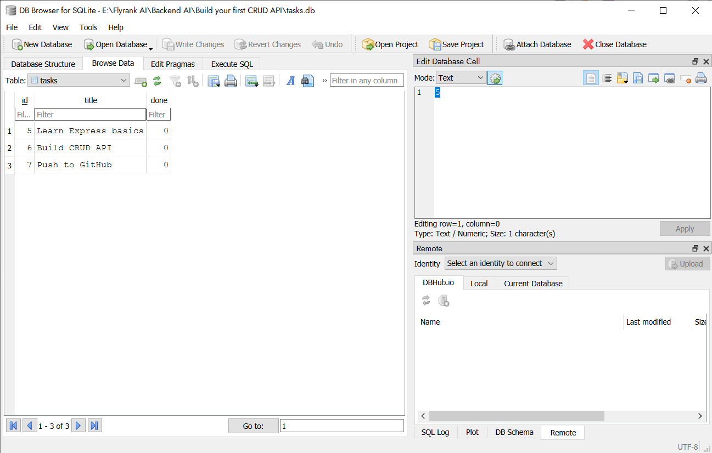

# Task CRUD API

A simple Express.js REST API for managing tasks, now backed by a real SQLite database. Built as part of the FlyRank Backend AI Engineering track — Week 2 (in-memory CRUD) and Week 3 (SQLite persistence).

## Features

- Full CRUD support: Create, Read, Update, Delete tasks
- Persistent storage via SQLite — data survives server restarts
- Input validation on task creation
- Interactive API documentation via Swagger UI
- Parameterized SQL queries throughout (no string-glued SQL)

## Tech Stack

- Node.js
- Express.js
- better-sqlite3 (synchronous SQLite driver)
- Swagger UI (API documentation)

## Why SQLite

SQLite was chosen because it needs no separate server or installation — the entire database is a single file (`tasks.db`) created automatically the first time the app runs. For a small learning project like this, that's the simplest way to get real persistence without setting up and managing a database server.

## Database File

The database lives in `tasks.db` in the project root. It's created automatically on first run, and the `tasks` table is created (and seeded with 3 example tasks) only if it doesn't already exist — so restarting the server never duplicates the seed data. `tasks.db` is git-ignored, so a fresh clone always starts with a clean, auto-seeded database.

## Getting Started

### Prerequisites

- Node.js (v18 or higher recommended)
- npm

### Installation

1. Clone the repository:

   ```
   git clone <your-repo-url>
   cd <repo-folder-name>
   ```

2. Install dependencies:

   ```
   npm install
   ```

3. Start the server:

   ```
   npm start
   ```

4. The server will run at `http://localhost:3000`, and `tasks.db` will be created automatically with 3 seeded tasks.

### API Documentation

Once the server is running, visit:

```
http://localhost:3000/api-docs
```

to view and test all endpoints interactively via Swagger UI.

## API Endpoints

| Method | Endpoint     | Description                    |
| ------ | ------------ | ------------------------------ |
| GET    | `/health`    | Check if the server is running |
| GET    | `/tasks`     | Get all tasks                  |
| GET    | `/tasks/:id` | Get a single task by ID        |
| POST   | `/tasks`     | Create a new task              |
| PUT    | `/tasks/:id` | Update an existing task        |
| DELETE | `/tasks/:id` | Delete a task                  |

All endpoints behave identically to the Week 2 in-memory version — only the storage layer changed, from a JS array to SQLite.

### Example: Create a task

**Request:**

```
POST /tasks
Content-Type: application/json

{
  "title": "Buy milk"
}
```

**Response (201 Created):**

```json
{
  "id": 4,
  "title": "Buy milk",
  "done": 0
}
```

### Example: Task not found

**Request:**

```
GET /tasks/99
```

**Response (404 Not Found):**

```json
{
  "error": "Task not found"
}
```

## Status Codes Used

- `200` — Successful GET/PUT
- `201` — Task successfully created
- `204` — Task successfully deleted (no content returned)
- `400` — Invalid request (e.g. missing title)
- `404` — Task not found

## Database Screenshot

__

## Exploring the Database by Hand (Stage 4)

Opened `tasks.db` directly in DB Browser for SQLite and ran queries manually to confirm the API and the database file are the same source of truth — no restart needed to see changes reflected through the API.

**Example query run:**

```sql
DELETE FROM tasks WHERE done = 1;
```

**Result:** 3 rows affected — all seeded tasks were deleted after first being marked `done = 1` with an `UPDATE`. Restarting the server afterward triggered the seed logic again (since the table was empty), but the new tasks came back with IDs 5, 6, 7 instead of 1, 2, 3 — SQLite's `AUTOINCREMENT` never reuses an ID that's already been issued, even after every row referencing it is deleted.

## Notes

- Data is now persistent — it survives server restarts, unlike the Week 2 in-memory version.
- All CRUD operations use parameterized queries (`?` placeholders) to avoid SQL injection.
- This project was built as part of an AI Fluency internship track, with Claude used as a pair-programming/tutoring tool throughout development.

## Author

Haroon Ameer Khan
