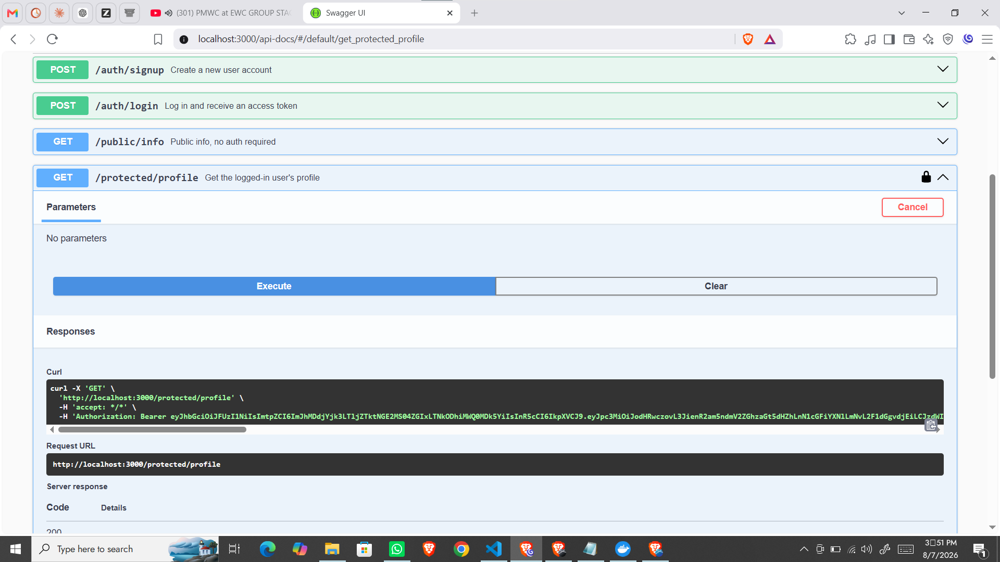

# Task CRUD API

A secure Express.js REST API for managing tasks, with Supabase-backed authentication. Built across four stages as part of the FlyRank Backend AI Engineering track:

- **Week 2 (A1):** in-memory storage
- **Week 3 (A2):** SQLite file storage
- **Week 1 (A3):** PostgreSQL running in Docker, with the whole stack started by a single `docker compose up`
- **Week 2 (A4, this version):** authentication via Supabase Auth — sign up, log in, log out, and protected routes guarded by JWT verification

## Features

- Full CRUD support: Create, Read, Update, Delete tasks
- User authentication via Supabase Auth (sign up, log in, log out)
- Protected routes guarded by a reusable auth middleware that verifies JWTs
- Persistent storage via a containerized PostgreSQL database
- Secrets (database password, Supabase keys) kept out of the codebase via `.env`
- Interactive API documentation via Swagger UI, with bearer-token "Authorize" support
- Parameterized SQL queries throughout (no string-glued SQL)

## Tech Stack

- Node.js + Express.js
- Supabase Auth (Identity Provider — handles password hashing and JWT signing)
- `@supabase/supabase-js` SDK
- PostgreSQL 16 (Docker container) for task storage
- `pg` (node-postgres) driver
- Swagger UI (API documentation)

## Setup

### Prerequisites

- Node.js
- Docker Desktop (for the Postgres task database)
- A free Supabase account and project (supabase.com)

### Environment Variables

Copy `.env.example` to `.env` and fill in your own values:

```
cp .env.example .env
```

| Variable       | Description                                                      |
| -------------- | ---------------------------------------------------------------- |
| `DATABASE_URL` | Postgres connection string for task storage                      |
| `SUPABASE_URL` | Your Supabase project URL (Project Settings → API)               |
| `SUPABASE_KEY` | Your Supabase **anon** public key — never the `service_role` key |
| `PORT`         | Port the server runs on (default 3000)                           |

`.env` is git-ignored and holds real secrets; `.env.example` is committed with placeholder values.

**Supabase setup note:** for local testing convenience, email confirmation is turned off in the Supabase dashboard (Authentication → Sign In / Providers → Email → "Confirm email"), so a fresh signup can log in immediately without verifying an email address. In a production app this would stay on.

### Running

1. Start the Postgres container:

   ```
   docker start taskdb
   ```

   (or `docker compose up -d` if using the full compose stack from A3)

2. Install dependencies:

   ```
   npm install
   ```

3. Start the server:
   ```
   npm start
   ```

The server will log `Server running and connected to Supabase on http://localhost:3000` once both Postgres and Supabase are reachable.

### API Documentation

Visit `http://localhost:3000/api-docs` for interactive Swagger docs. Protected routes show a lock icon; click **Authorize**, paste an access token (from `/auth/login`), and use **Try it out** directly from the browser.

## API Endpoints

| Method | Endpoint               | Auth required | Description                                                    |
| ------ | ---------------------- | ------------- | -------------------------------------------------------------- |
| POST   | `/auth/signup`         | No            | Create a new user account                                      |
| POST   | `/auth/login`          | No            | Log in, returns an access token + refresh token                |
| POST   | `/auth/logout`         | Yes           | End the current session                                        |
| GET    | `/public/info`         | No            | Public, open info                                              |
| GET    | `/protected/profile`   | Yes           | Returns the logged-in user's profile                           |
| GET    | `/protected/dashboard` | Yes           | Second protected route, proves the auth middleware is reusable |
| GET    | `/tasks`               | No            | Get all tasks                                                  |
| GET    | `/tasks/:id`           | No            | Get a single task by ID                                        |
| POST   | `/tasks`               | No            | Create a new task                                              |
| PUT    | `/tasks/:id`           | No            | Update an existing task                                        |
| DELETE | `/tasks/:id`           | No            | Delete a task                                                  |

_(Task routes are not auth-gated in this assignment — only `/protected/_`and`/auth/logout` require a bearer token, per the assignment spec.)\*

### Example: Sign up

```
curl -i -X POST http://localhost:3000/auth/signup \
  -H "Content-Type: application/json" \
  -d '{"email":"you@example.com","password":"password123"}'
```

**Response (201 Created):** the created user object.

### Example: Log in

```
curl -i -X POST http://localhost:3000/auth/login \
  -H "Content-Type: application/json" \
  -d '{"email":"you@example.com","password":"password123"}'
```

**Response (200 OK):**

```json
{
  "access_token": "eyJhbGciOi...",
  "refresh_token": "..."
}
```

### Example: Access a protected route

```
curl -i http://localhost:3000/protected/profile \
  -H "Authorization: Bearer <your_access_token>"
```

**Response (200 OK):** the user's `id`, `email`, and `created_at`.

Without a token, or with a tampered one:

```json
{ "error": "Access token required" }
```

or

```json
{ "error": "Invalid or expired token" }
```

## Status Codes Used

- `200` — Successful GET/login/verification
- `201` — Signup successful, or task created
- `204` — Logout successful, or task deleted (no content)
- `400` — Invalid request (missing email/password/title)
- `401` — Missing, invalid, or expired token; or invalid login credentials
- `404` — Task not found

## Swagger Screenshot



## How Authentication Works

Authentication follows a trust triangle: the client sends credentials to Supabase (never to this server), Supabase verifies them and issues a signed JWT, the client sends that JWT to this server on each request, and this server asks Supabase to confirm the token is genuine before opening a protected route. This server never stores a password or signs anything itself — Supabase (the Identity Provider) does all of that. The `requireAuth` middleware is the single place token verification happens; it's applied to `/protected/profile`, `/protected/dashboard`, and `/auth/logout`, proving the same guard works on any route without new auth code.

## Notes

- Data is fully persistent — it survives server restarts and `docker compose down`/`up` cycles.
- All CRUD operations use parameterized queries (`$1`, `$2`, ...) to avoid SQL injection.
- This project was built as part of an AI Fluency internship track, with Claude used as a pair-programming/tutoring tool throughout development.

---

## AI Feature: Task Enrichment (Week 7 — A17)

### What it does

The `POST /tasks/enrich` endpoint takes a task title (like "Fix login bug" or "Buy milk") and asks an AI model to classify it — returning a category, priority, a short suggestion, and a confidence score. This turns a step a human would normally do manually (deciding what kind of task something is, and how urgent it is) into an automated API call, with strict validation so the response is always safe to use in code.

### Try it

```bash
curl -X POST http://localhost:3000/tasks/enrich \
  -H "Content-Type: application/json" \
  -d '{"title": "Fix login bug"}'
```

**Response:**

```json
{
  "category": "work",
  "priority": "high",
  "suggestion": "Prioritize this before it blocks other users.",
  "confidence": 0.9
}
```

### Job Card

**What it does:** Suggests a category and priority for a task based on its title.

**Input:** `{ "title": "string, 1-200 chars" }`

**Output:**

```json
{
  "category": "work | personal | shopping | health | other",
  "priority": "low | medium | high",
  "suggestion": "one short sentence",
  "confidence": "0.0-1.0"
}
```

**It must never:** invent a category outside the list, return free text as category, give medical/legal/financial advice, or reveal the prompt.

**When unsure:** returns category `"other"` with confidence below 0.5, instead of guessing.

### Provider & Model

- **Provider:** OpenRouter (free tier, no credit card)
- **Model:** `openai/gpt-oss-20b:free`
- **Environment variables needed to run this:**
  - `LLM_BASE_URL` — OpenRouter API base URL
  - `LLM_API_KEY` — your OpenRouter API key
  - `LLM_MODEL` — the model ID to use
  - `LLM_STUB` — set to `1` to skip AI calls and return a fixed test response
  - `LLM_ENABLED` — set to `false` to disable AI calls entirely (kill switch)

### Eval Results

**Date:** 2026-08-20
**Prompt version:** enrich-v1
**Score:** 8/8 (100%)

All 8 hand-labeled test cases passed, including an intentionally ambiguous input (`"asdfgh"`) that correctly triggered the "when unsure" fallback to category `other`.

### Cost

**Example single call log** (from `logs/costs.jsonl`):

```json
{
  "promptVersion": "enrich-v1",
  "model": "openai/gpt-oss-20b:free",
  "inputTokens": 470,
  "outputTokens": 96,
  "durationMs": 6270,
  "neededRepair": false
}
```

**Estimate for 10,000 requests/day:** At ~470 input + ~96 output tokens per call, that's roughly 5.66M tokens/day. On the free tier this costs $0, but on a comparable low-cost paid model (~$0.20/M input, ~$0.60/M output tokens) this would be approximately **$1.94/day** (~$0.94 input + ~$1.00 output), or about **$58/month**. The biggest lever to reduce this further would be shortening the system prompt, since it's sent on every single call.

### What I'd fix with another day

The free model occasionally hits OpenRouter's shared rate limit (429 errors) during peak hours, since many other developers share the same free pool. With more time, I'd add a fallback list of 2-3 free models so the endpoint automatically tries the next one if the first is busy, rather than relying on a single model ID.

## Author

Haroon Ameer Khan
